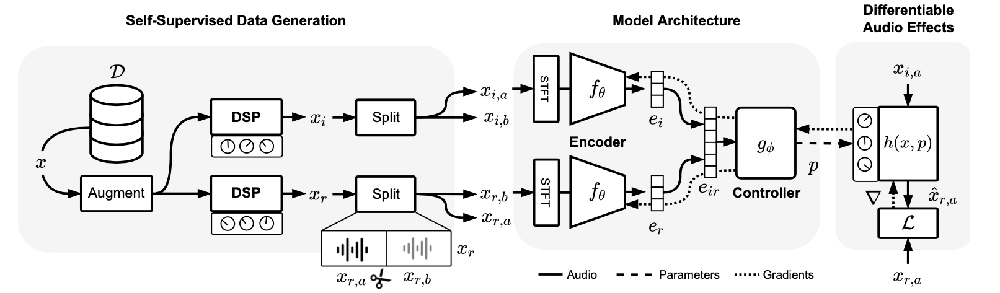
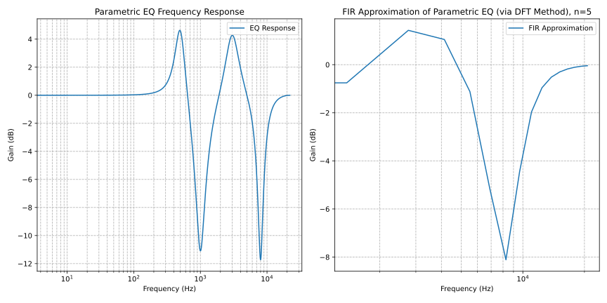
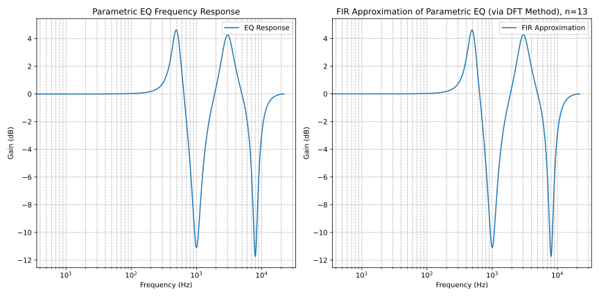

# Style Transfer of Audio Effects with Differentiable Signal Processing

This project focuses on applying audio effects to a target audio track based on a reference track. The primary effects considered are compressors and equalizers. The project employs a self-supervised data generation approach and a differentiable signal processing model to achieve this.

## Introduction

The goal is to apply specific audio effects to an audio track in a manner that aligns with a reference track. The effects considered in this project are limited to compressors and equalizers.

## Pipeline

The pipeline consists of several stages, including self-supervised data generation, model architecture, and differentiable audio effects.

### Self-Supervised Data Generation

1. **Data Augmentation**: An audio file $x$ is augmented by applying random pitch shifts and tempo stretches to help the model generalize.
2. **Effects Application**: Random audio effects are applied to create input $(x_i)$ and reference $(x_r)$ signals.
3. **Splitting**: Both $x_i$ and $x_r$ are split into corresponding segments $x_{i,a}$, $x_{i,b}$, $x_{r,a}$, and $x_{r,b}$. The goal is to make $x_{i,a}$ sound like $x_{r,a}$.

### Model Architecture

The model uses an encoder-controller architecture to process the audio signals and apply the necessary effects. The encoder extracts features from the input and reference signals, which are then used by the controller to adjust the parameters of the audio effects.



### Differentiable Audio Effects

Most audio effects are Infinite Impulse Response (IIR) filters, which can be expressed as:

```math
y[n] = \sum_{i=0}^{P} b_{i} x[n-i] + \sum_{i=1}^{Q} a_{i} y[n-i]
```

To make these effects differentiable, especially for backpropagation, we approximate IIR filters using the frequency-sampling method to convert them into Finite Impulse Response (FIR) filters.





### Training Loss

The training loss combines time-domain and frequency-domain components, including a multi-resolution STFT loss:

```math
\mathcal{L}_{M R-S T F T}(\hat{x}, x)=\frac{1}{M} \sum_{m=1}^{M}\left(\mathcal{L}_{S C}(\hat{x}, x)+\mathcal{L}_{S M}(\hat{x}, x)\right)
```

where

```math
\mathcal{L}_{S C}(\hat{x}, x)=\frac{\| \| S T F T(x) \|-\| S T F T(\hat{x}) \| \|_{F}}{\| \| S T F T(x) \| \|_{F}}
```

and

```math
\mathcal{L}_{S M}(\hat{x}, x)=\frac{1}{N}\| \log (| S T F T(x) |)-\log (| S T F T(\hat{x}) |) \|_{1}
```

## Results

The project evaluates the performance using metrics such as PESQ, STFT distance, and LUFS. The results are compared across different datasets and methods.

## Future Work

Future work includes exploring additional audio effects and improving the differentiability of existing effects for better training and performance. It is further explained in [this article](https://arxiv.org/abs/2410.21233).
